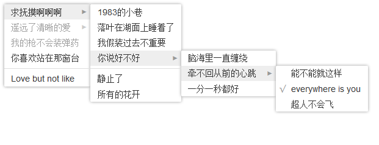

what's this?
=========

实用而且有趣的代码片段

# Navigation
* [css-multi-level-menu & 纯CSS无限制级联菜单](#css-multi-level-menu)

# css-multi-level-menu
纯CSS无限制级联菜单。

引入css文件
```html
<link href="../../libs/css-multi-level-menu/multi-menu.css" rel="stylesheet">
```

HTML部分
```html
<div class="multi-menu">
    <ul>
        <li class="multi-menu-parent">
            <span class="name">Put the mouse above me</span>
            <ul>
                <li>
                    <span class="name">I'm a normal item</span>
                </li>
                ...
            </ul>
        </li>
        <li>
            <span class="name">I'm a normal item3</span>
        </li>
        ...
    </ul>
</div>
```

上面的例子展示了一个简单的二级菜单，更多级按照同样的格式增加即可

通过给 `li` 增加class来增强功能：

* `multi-menu-parent` 表示该菜单项下面有子级菜单
* `disabled` 表示该菜单项为不可点击状态
* `separate` 表示分隔线

给 `ul` 增加class `check-list` 模仿复选框的效果，同时给子级菜单项增加class `checked` 可以选中该项，选中的项前面会有一个 `√` 标识

下面是一个结构更复杂功能更多的示例：
```html
<div class="multi-menu">
    <ul>
        <li class="multi-menu-parent">
            <span class="name">Put the mouse above me</span>
            <ul>
                <li>
                    <span class="name">I'm a normal item</span>
                </li>
                <li class="separate"></li>
                <li>
                    <span class="name">I'm a normal item2</span>
                </li>
                ...
            </ul>
        </li>
        <li class="disabled">
            <span class="name">I'm a disabled item</span>
        </li>
        <li class="multi-menu-parent">
            <span class="name">I'm a normal item4</span>
            <ul class="check-list">
                <li>
                    <span class="name">I'm a normal item</span>
                </li>
                <li class="checked">
                    <span class="name">I'm checked!</span>
                </li>
                ...
            </ul>
        </li>
        <li class="separate"></li>
        <li>
            <span class="name">I'm a normal item5</span>
        </li>
        ...
    </ul>
</div>
```

另外，如果你更喜欢less的方式，同样也提供了 [less文件](/libs/css-multi-level-menu/multi-menu.less)

以上示例只需要 `CSS` 和 `HTML`，没有脚本，也没有图片引用，低碳环保

运行效果如下图：



[猛击我查看Demo](http://blog.jsfor.com/demo/css-multi-level-menu/)

### 扩展

如果想要类似操作系统，前面带有图标的菜单，那么，HTML结构只需要稍微的改一改：

```html
<li>
    <span class="glyphicon glyphicon-heart"></span>
    <span class="name">I'm a normal item3</span>
</li>
```

图标库推荐采用 `bootstrap3` 提供的字体图形库 `Glyphicons`

如果想要 `悬停` 的效果，那必须要借助JS来实现，比如用jQuery库可以这么写

```javascript
$('.multi-menu li').on('mouseover', function(){
    var that = $(this);
    if(that.hasClass('disabled')) return;
    if(that.hasClass('multi-menu-parent')){
        that.find('> ul').show();
    }
    that.siblings('li').find('ul').hide();
});
// 点击空白处隐藏
$('html').on('click', function(){
    var menu = $('.multi-menu');
    if(menu.length){
        menu.find('li.multi-menu-parent > ul').hide();
    }
});
```

同时还需要对 `multi-menu.css` 作一个小小的改动，去掉下面这一句

```css
.multi-menu ul li.multi-menu-parent:not(.disabled):hover > ul {
  display: block;
}
```

或者直接使用改好的 [multi-menu-with-js.css](/libs/css-multi-level-menu/multi-menu-with-js.css)

[猛击我查看Demo（扩展）](http://blog.jsfor.com/demo/css-multi-level-menu/index-with-js.html)